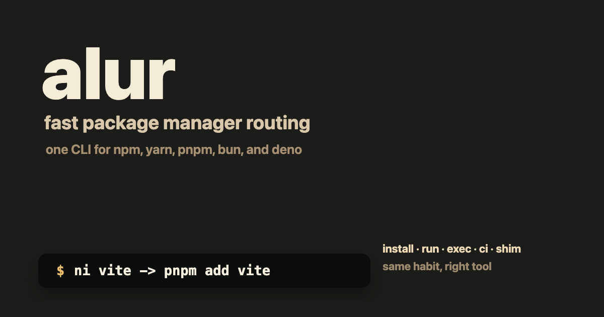

# alur



[](https://github.com/happytoolin/alur/actions/workflows/ci.yml)
[](https://www.gnu.org/licenses/gpl-3.0)
[](https://www.npmjs.com/package/@happytoolin/alur)


Website: [`alur.happytoolin.com`](https://alur.happytoolin.com)

`alur` is a native package-manager command router for `npm`, `yarn`, `pnpm`, `bun`, and `deno`.

It has three main jobs:

1. Fast mode runs eligible scripts and local bins directly, skipping package-manager CLI startup.
2. The `ni` command family gives you one set of commands across every package manager.
3. The optional `node` shim lets you type `node install`, `node run`, and `node exec` like Node had Bun-style package commands.

`alur` is beta software. The supported interface is the CLI; Rust crate modules are internal and do not carry a stable API guarantee.

## Quick Start

Install it on macOS / Linux:

```bash
curl -fsSL https://bin.happytoolin.com/alur | sh
alur --version
```

Install it with PowerShell:

```powershell
irm https://bin.happytoolin.com/alur.ps1 | iex
alur --version
```

Or install from npm:

```bash
npm install -g @happytoolin/alur
alur --version
```

Use the short commands:

```bash
ni vite              # add vite with the detected package manager
nr dev               # run the dev script, using fast mode when safe
nlx eslint .         # run a local bin directly when possible
nci                  # clean install from the lockfile
```

Or use the explicit `alur` commands:

```bash
alur install vite
alur run dev
alur exec eslint .
alur ci
```

Enable the optional `node` shim when you want Node to behave like an all-in-one package command:

```bash
eval "$(alur init zsh)"
node install vite
node run dev
node exec vitest
```

## Install

### npm

```bash
npm install -g @happytoolin/alur
alur --version
```

The npm package installs `alur` plus the multicall aliases: `ni`, `nr`, `nlx`, `nun`, `nci`, `np`, and `ns`.

The `node` shim is not enabled by npm install. It is always opt-in through `alur init <shell>`.

Under the hood, npm postinstall downloads the matching native `alur` binary from the GitHub release.

### Homebrew

```bash
brew tap happytoolin/happytap
brew install alur
alur --version
```

### Script Install

macOS / Linux:

```bash
curl -fsSL https://bin.happytoolin.com/alur | sh
```

Shell script alias:

```bash
curl -fsSL https://bin.happytoolin.com/alur.sh | sh
```

PowerShell:

```powershell
irm https://bin.happytoolin.com/alur.ps1 | iex
```

Direct GitHub release URLs are available too:

```bash
curl --proto '=https' --tlsv1.2 -LsSf https://github.com/happytoolin/alur/releases/latest/download/alur-installer.sh | sh
```

Pin a specific version:

```bash
curl --proto '=https' --tlsv1.2 -LsSf https://github.com/happytoolin/alur/releases/download/v0.0.4/alur-installer.sh | sh
```

CI example:

```bash
curl --proto '=https' --tlsv1.2 -LsSf https://github.com/happytoolin/alur/releases/download/v0.0.4/alur-installer.sh | sh
echo 'export PATH="$HOME/.cargo/bin:$PATH"' >> "$GITHUB_ENV"
```

Use `releases/latest/download` to follow the latest release. Use a versioned release URL for repeatable automation.

## Feature 1: Fast Mode

Fast mode is the default for eligible `nr`, `alur run`, `nlx`, `alur exec`, and matching `node` shim commands.

Instead of starting `npm run`, `pnpm exec`, or another package-manager CLI, `alur` resolves the script or local executable itself and launches it directly.

```bash
nr dev
alur run test -- --watch
nlx eslint .
node run dev
node exec vitest
```

Fast mode currently targets common local work:

- `package.json` scripts, including `pre<script>` and `post<script>` lifecycle hooks
- nearest `deno.json` / `deno.jsonc` tasks in Deno projects
- local bins in `node_modules/.bin`
- pnpm hoisted bins under `node_modules/.pnpm/node_modules/.bin`
- package-local `bin` entries

If `alur` cannot prove the fast path is correct, it falls back to package-manager mode.

Common fallback cases include Yarn Plug'n'Play, Deno workspaces, remote package exec, and scripts that depend on package-manager-specific env expansion.

Control it per command:

```bash
nr --fast dev        # prefer fast mode
nr --pm dev          # force package-manager mode
nlx --pm create-vite@latest
node run --pm dev
```

Inspect what happened:

```bash
nr dev --print-command
nr dev --explain
alur doctor
```

Latest tracked fast benchmark snapshot: fast mode averaged `4.59x` faster than package-manager mode, with local-bin exec cases like `nlx hello --flag` reaching `47.43x`.

See [`benchmark/LATEST.md`](benchmark/LATEST.md) for the current snapshot and [`docs/fast-compat.md`](docs/fast-compat.md) for the exact compatibility rules.

## Feature 2: Short Commands

Use one command vocabulary and let `alur` pick the right package manager from the project.

| Task                                 | Short command | Explicit command  |
| ------------------------------------ | ------------- | ----------------- |
| Install dependencies or add packages | `ni`          | `alur install`    |
| Run scripts                          | `nr`          | `alur run`        |
| Execute package binaries             | `nlx`         | `alur exec`       |
| Uninstall packages                   | `nun`         | `alur uninstall`  |
| Clean install                        | `nci`         | `alur ci`         |
| Run shell commands in parallel       | `np`          | `alur parallel`   |
| Run shell commands sequentially      | `ns`          | `alur sequential` |

### Install / Add

`ni` installs dependencies when called with no package names. It adds packages when package names are present.

```bash
ni
ni vite
ni react react-dom
ni -D vitest
ni -g eslint
ni --frozen
ni --frozen-if-present
```

Examples by detected package manager:

| Project | `ni`           | `ni vite`       |
| ------- | -------------- | --------------- |
| npm     | `npm i`        | `npm i vite`    |
| yarn    | `yarn install` | `yarn add vite` |
| pnpm    | `pnpm i`       | `pnpm add vite` |
| bun     | `bun install`  | `bun add vite`  |
| deno    | `deno install` | `deno add vite` |

Global installs use `global_package_manager`, which defaults to `npm`.

### Run Scripts

`nr` runs package scripts. With no script name, it runs `start`.

```bash
nr
nr dev
nr build
nr test -- --watch
nr --if-present lint
```

In fast mode, `nr` can skip the package manager and run the script directly. Use `--pm` when you need exact package-manager behavior.

### Execute Binaries

`nlx` runs package binaries.

```bash
nlx vitest
nlx eslint .
nlx create-vite@latest
```

When a local executable can be resolved confidently, `nlx` runs it directly. Remote or ambiguous cases fall back to the detected package manager.

### Uninstall / Clean Install

```bash
nun lodash
nun react react-dom
nun -g typescript

nci
nci --prefer-offline
```

`nci` uses a package-manager-specific frozen install when a lockfile exists. Without a lockfile, it falls back to normal install behavior.

### Parallel / Sequential Shell Commands

Each argument is a separate shell command.

```bash
np "pnpm dev" "pnpm test"
ns "pnpm lint" "pnpm test"
```

`np` runs all commands concurrently and returns the first non-zero exit code. `ns` runs commands in order and stops on the first failure.

## Feature 3: Node Shim

The `node` shim is for people who want package commands to feel built into Node.

After init, these work:

```bash
node install
node install vite
node add react
node uninstall lodash
node remove lodash
node run dev
node exec vitest
node x eslint .
node ci
node p "echo one" "echo two"
node s "pnpm lint" "pnpm test"
```

That gives Node a Bun-like command surface, while still using your project's real package manager.

The shim routes known alur shim verbs and aliases:

| `node` input                      | Routes to                 |
| --------------------------------- | ------------------------- |
| `node install`, `node i`          | install or add behavior   |
| `node add`                        | add behavior              |
| `node uninstall`, `node remove`   | uninstall behavior        |
| `node run`                        | script runner             |
| `node exec`, `node x`, `node dlx` | binary executor           |
| `node ci`                         | clean install             |
| `node p`                          | parallel shell commands   |
| `node s`                          | sequential shell commands |

Everything else passes through to the real Node.js binary:

```bash
node script.js
node -v
node --run dev
node --watch server.js
node -- --trace-warnings
```

### Enable It

Run `alur init` for your shell and put the output at the end of your shell config, after tools like `nvm`, `mise`, `asdf`, `fnm`, or `volta`.

zsh (`~/.zshrc`):

```bash
eval "$(alur init zsh)"
```

bash (`~/.bashrc`):

```bash
eval "$(alur init bash)"
```

fish (`~/.config/fish/config.fish`):

```fish
alur init fish | source
```

PowerShell (`$PROFILE`):

```powershell
Invoke-Expression (& alur init powershell)
```

Nushell (`~/.config/nushell/config.nu`):

```nu
alur init nushell | save --force ~/.config/nushell/alur.nu
source ~/.config/nushell/alur.nu
```

Restart your shell after editing your config.

`alur init` creates a managed `node` launcher and prints shell-specific PATH setup. On routed commands, `alur` finds the real Node.js binary and keeps normal Node behavior available.

If real Node cannot be found, set `ALUR_REAL_NODE=/absolute/path/to/node`.

To disable the shim, remove the `alur init` line from your shell config and restart the shell.

## Package Manager Detection

`alur` detects the package manager from:

1. `packageManager` in `package.json`
2. lockfiles such as `pnpm-lock.yaml`, `pnpm-workspace.yaml`, `yarn.lock`, `package-lock.json`, `bun.lockb`, or `deno.lock`
3. `devEngines.packageManager` in `package.json`
4. install metadata such as `.pnp.cjs`, `node_modules/.pnpm`, or `node_modules/.package-lock.json`
5. config defaults if detection is unavailable

When detection fails, add a `packageManager` field, commit a lockfile, or set `default_package_manager`.

## Configuration

Config file:

- `$XDG_CONFIG_HOME/alur/config.toml`
- macOS default: `~/Library/Application Support/alur/config.toml`
- Windows default: `%APPDATA%\alur\config.toml`

Supported keys:

```toml
default_package_manager = "pnpm"
global_package_manager = "npm"
fast_mode = true
```

Environment overrides:

- `ALUR_CONFIG_FILE`
- `ALUR_DEFAULT_PACKAGE_MANAGER`
- `ALUR_GLOBAL_PACKAGE_MANAGER`
- `ALUR_FAST_MODE`
- `ALUR_REAL_NODE`

## Global Flags

These work across `alur`, the `ni` aliases, and routed `node` shim commands:

```bash
--fast
--pm
--print-command
--explain
-C <dir>
-v --version
-h --help
```

For the `node` shim, alur only parses these flags after a routed verb. Normal
Node.js flags and non-routed first arguments are passed through untouched:

```bash
node run --pm dev --print-command
node --run dev --print-command
node --conditions=dev script.js
```

Use `--` to forward flags to the underlying package manager or script:

```bash
alur install -- --help
nr test -- --watch
node run test -- --watch
```

## Utilities

```bash
alur help
alur help ni
alur completion zsh
alur init bash
alur doctor
```

## Troubleshooting

### PowerShell `ni` Alias Conflict

PowerShell ships with a built-in `ni` alias for `New-Item`.

If that conflicts with `alur`, remove or override it in your profile before loading `alur`:

```powershell
Remove-Item Alias:ni -ErrorAction SilentlyContinue
Invoke-Expression (& alur init powershell)
```

### Check What Will Run

Use `--print-command` for the resolved command and `--explain` for detection details:

```bash
ni vite --print-command
nr dev --explain
node install vite --print-command
```

### Skip Fast Mode For Exact PM Behavior

Fast mode intentionally does not emulate every package-manager edge case.

Use `--pm` for Yarn PnP projects, Deno workspaces, package-manager-specific env expansion, or debugging exact package-manager behavior:

```bash
nr --pm build
nlx --pm create-vite@latest
node run --pm dev
```

## Benchmarking

The benchmark suite lives in [`benchmark/`](benchmark/).

Common local commands:

```bash
npm ci
npm run bench
npm run bench -- --track=all --runs=100 --warmups=10
```

Generate flamegraphs:

```bash
./benchmark/profile.sh
```

Tracked benchmark docs:

- current snapshot: [`benchmark/LATEST.md`](benchmark/LATEST.md)
- lightweight history: [`benchmark/HISTORY.md`](benchmark/HISTORY.md)
- benchmark guide: [`benchmark/README.md`](benchmark/README.md)
- fast-mode compatibility: [`docs/fast-compat.md`](docs/fast-compat.md)

## Acknowledgement

The short command family follows the spirit of Antfu's [`ni`](https://github.com/antfu-collective/ni#readme).
